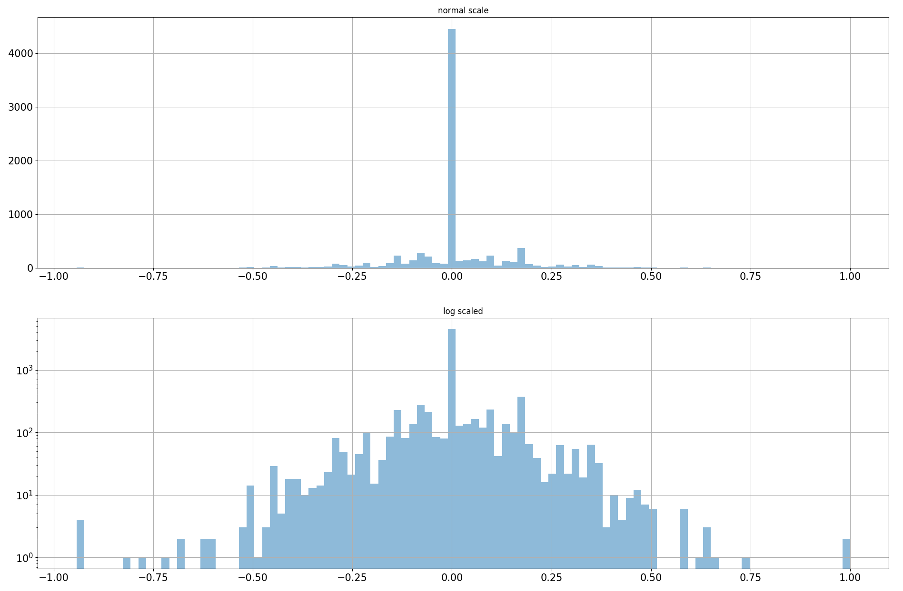
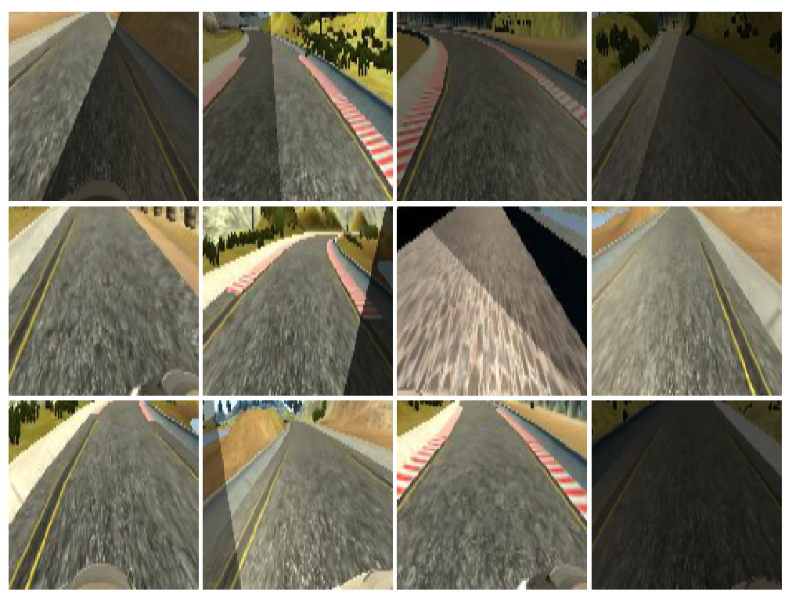
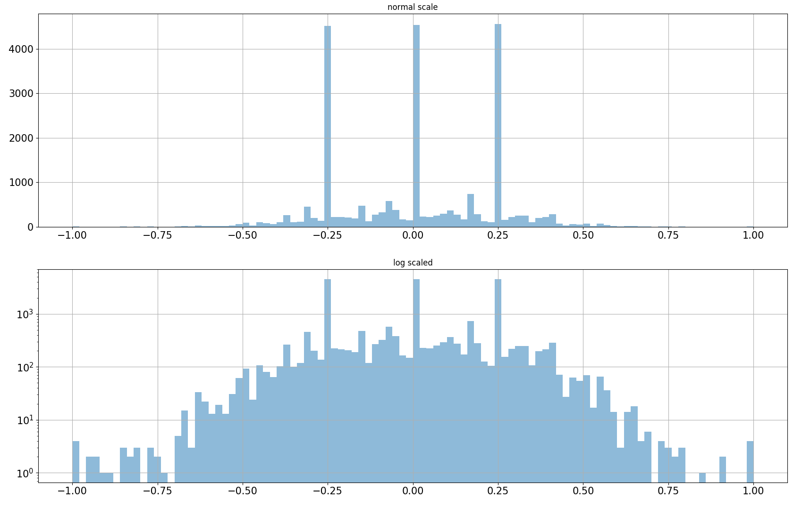
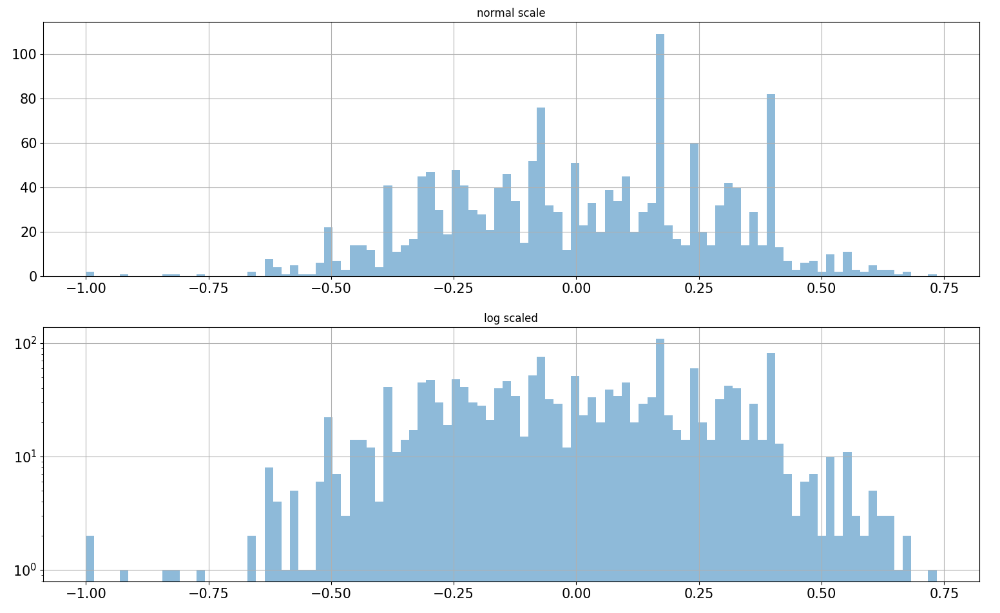

# Project 3: Use Deep Learning to Clone Driving Behavior

[](http://www.udacity.com/drive)

The Project
---
* Implementation of behavioural cloning model
* Details of Augmentation Process
* Video generation
* Discussion

### Project files:
- `model.py` contains class Model with static methods for generation model and trainings:
    - _DenseNet_ based model
    - _SimpleNet_ neural network model
- `dataproc.py` contains two classes:
    - `Augment` is responsible for augmentation:
        * Height Cropping
        * Left-Right flipping
        * Brightness adjusting
        * Appliance of shadow mask on an input image
    - `TrackDataset` is responsible for:
        * Loading dataset
        * Augmenting images
        * Splitting dataset on testing and validation datasets
        * Batch generation for training and validation
- `common.py` contains auxiliary function for loading images and changing color map.
- `video.mp4` video of first track challenge.
- `model.h5` best _keras_ model

### Implementation

#### DenseNet based model

After reading NVIDIA's paper about driver behaviour cloning, I have decided to use my own neural network based on DenseNet. I came up with this solution:
* Batch size is `128`
* Input image shape `(12, 128, 3)`
* Input image in `RGB` color map
* `3` DenseNet blocks
* `3` layers per each block with growing factor `12`
* Batch normalization before each activation function
* `ELU` activation function was used, because as I think standard `ReLU` function will not work for _regression problem_. I think that the best activation function for regression challenges is `Leaky ReLU`, but I did not try it in this work.
* `3` fully connected layers
* Adam optimizer with `1E-03` learning rate and `1E-08` epsilon
* `10` epochs

It happened that this model is hardly trainable and the converge takes too long on my `GTX-1080`, after 10 epochs (5 hours) I had **0.15 validation error** and results of driving were really poor, so that even on first turn the car went into the river.

I was really disappointed with gained results, but I didn't want to go with NVIDIA solution. After playing with different configurations I stayed with this one, and let's call it as _SimpleNet_:
* Batch size is `128` - _Same as in DenseNet_
* Input image shape `(12, 128, 3)` - _Same as in DenseNet_
* Input image in `RGB` color map - _Same as in DenseNet_
* `4` convolution layers with max pooling
* `ELU` activation function - _Same as in DenseNet_
* `3` fully connected layers with following `1` neuron dense layer
* Adam optimizer with `1E-03` learning rate
* `20` epochs

I started with learning rate `1E-1` for **Adam** and could get only `0.1 validation error`, but when I decreased learning rate to `1E-04` I have got **0.01 validation error**, such small change improved accuracy significantly.

Finally, I have gotten good result on first track, after several attempts of building neural networks and moreover my car almost finished challenge track.

>>> NOTE: Before submitting images into the model the normalization procedure is applied: the mean of the image is subtracted from it, given result is divided by standard deviation of the original image, for avoiding zero division the standardisation algorithm replaces `0.0f` standard deviation with `1/(image_width * image_height * image_depth)` value.

>>> NOTE: As you may notice the number of parameter of _DenseNet_ and _SimpleNet_ almost identical: `189,373` and `183,683` respectively, but training time is for _SimpleNet_ is extremely lower. I spent less than 30 minutes on 20 epochs. I think it is a good theme for research to figure out what's going on and why _DenseNet_ is so computationally expensive.

##### Architectures

**SimpleNet** model architecture:
```
____________________________________________________________________________________________________
Layer (type)                     Output Shape          Param #     Connected to                     
====================================================================================================
convolution2d_1 (Convolution2D)  (None, 124, 124, 8)   608         convolution2d_input_1[0][0]      
____________________________________________________________________________________________________
maxpooling2d_1 (MaxPooling2D)    (None, 62, 62, 8)     0           convolution2d_1[0][0]            
____________________________________________________________________________________________________
convolution2d_2 (Convolution2D)  (None, 58, 58, 8)     1608        maxpooling2d_1[0][0]             
____________________________________________________________________________________________________
activation_1 (Activation)        (None, 58, 58, 8)     0           convolution2d_2[0][0]            
____________________________________________________________________________________________________
maxpooling2d_2 (MaxPooling2D)    (None, 29, 29, 8)     0           activation_1[0][0]               
____________________________________________________________________________________________________
convolution2d_3 (Convolution2D)  (None, 26, 26, 16)    2064        maxpooling2d_2[0][0]             
____________________________________________________________________________________________________
maxpooling2d_3 (MaxPooling2D)    (None, 13, 13, 16)    0           convolution2d_3[0][0]            
____________________________________________________________________________________________________
convolution2d_4 (Convolution2D)  (None, 9, 9, 16)      6416        maxpooling2d_3[0][0]             
____________________________________________________________________________________________________
flatten_1 (Flatten)              (None, 1296)          0           convolution2d_4[0][0]            
____________________________________________________________________________________________________
dense_1 (Dense)                  (None, 128)           166016      flatten_1[0][0]                  
____________________________________________________________________________________________________
dense_2 (Dense)                  (None, 50)            6450        dense_1[0][0]                    
____________________________________________________________________________________________________
dense_3 (Dense)                  (None, 10)            510         dense_2[0][0]                    
____________________________________________________________________________________________________
dense_4 (Dense)                  (None, 1)             11          dense_3[0][0]                    
====================================================================================================
Total params: 183,683
Trainable params: 183,683
Non-trainable params: 0
____________________________________________________________________________________________________
None
```

**DenseNet** based architecture:
```
____________________________________________________________________________________________________
Layer (type)                     Output Shape          Param #     Connected to                     
====================================================================================================
input_1 (InputLayer)             (None, 128, 128, 3)   0                                            
____________________________________________________________________________________________________
convolution2d_1 (Convolution2D)  (None, 128, 128, 16)  432         input_1[0][0]                    
____________________________________________________________________________________________________
batchnormalization_1 (BatchNorma (None, 128, 128, 16)  512         convolution2d_1[0][0]            
____________________________________________________________________________________________________
activation_1 (Activation)        (None, 128, 128, 16)  0           batchnormalization_1[0][0]       
____________________________________________________________________________________________________
convolution2d_2 (Convolution2D)  (None, 128, 128, 12)  1728        activation_1[0][0]               
____________________________________________________________________________________________________
merge_1 (Merge)                  (None, 128, 128, 28)  0           convolution2d_1[0][0]            
                                                                   convolution2d_2[0][0]            
____________________________________________________________________________________________________
batchnormalization_2 (BatchNorma (None, 128, 128, 28)  512         merge_1[0][0]                    
____________________________________________________________________________________________________
activation_2 (Activation)        (None, 128, 128, 28)  0           batchnormalization_2[0][0]       
____________________________________________________________________________________________________
convolution2d_3 (Convolution2D)  (None, 128, 128, 12)  3024        activation_2[0][0]               
____________________________________________________________________________________________________
merge_2 (Merge)                  (None, 128, 128, 40)  0           convolution2d_1[0][0]            
                                                                   convolution2d_2[0][0]            
                                                                   convolution2d_3[0][0]            
____________________________________________________________________________________________________
batchnormalization_3 (BatchNorma (None, 128, 128, 40)  512         merge_2[0][0]                    
____________________________________________________________________________________________________
activation_3 (Activation)        (None, 128, 128, 40)  0           batchnormalization_3[0][0]       
____________________________________________________________________________________________________
convolution2d_4 (Convolution2D)  (None, 128, 128, 12)  4320        activation_3[0][0]               
____________________________________________________________________________________________________
merge_3 (Merge)                  (None, 128, 128, 52)  0           convolution2d_1[0][0]            
                                                                   convolution2d_2[0][0]            
                                                                   convolution2d_3[0][0]            
                                                                   convolution2d_4[0][0]            
____________________________________________________________________________________________________
batchnormalization_4 (BatchNorma (None, 128, 128, 52)  512         merge_3[0][0]                    
____________________________________________________________________________________________________
activation_4 (Activation)        (None, 128, 128, 52)  0           batchnormalization_4[0][0]       
____________________________________________________________________________________________________
convolution2d_5 (Convolution2D)  (None, 128, 128, 52)  2704        activation_4[0][0]               
____________________________________________________________________________________________________
averagepooling2d_1 (AveragePooli (None, 64, 64, 52)    0           convolution2d_5[0][0]            
____________________________________________________________________________________________________
batchnormalization_5 (BatchNorma (None, 64, 64, 52)    256         averagepooling2d_1[0][0]         
____________________________________________________________________________________________________
activation_5 (Activation)        (None, 64, 64, 52)    0           batchnormalization_5[0][0]       
____________________________________________________________________________________________________
convolution2d_6 (Convolution2D)  (None, 64, 64, 12)    5616        activation_5[0][0]               
____________________________________________________________________________________________________
merge_4 (Merge)                  (None, 64, 64, 64)    0           averagepooling2d_1[0][0]         
                                                                   convolution2d_6[0][0]            
____________________________________________________________________________________________________
batchnormalization_6 (BatchNorma (None, 64, 64, 64)    256         merge_4[0][0]                    
____________________________________________________________________________________________________
activation_6 (Activation)        (None, 64, 64, 64)    0           batchnormalization_6[0][0]       
____________________________________________________________________________________________________
convolution2d_7 (Convolution2D)  (None, 64, 64, 12)    6912        activation_6[0][0]               
____________________________________________________________________________________________________
merge_5 (Merge)                  (None, 64, 64, 76)    0           averagepooling2d_1[0][0]         
                                                                   convolution2d_6[0][0]            
                                                                   convolution2d_7[0][0]            
____________________________________________________________________________________________________
batchnormalization_7 (BatchNorma (None, 64, 64, 76)    256         merge_5[0][0]                    
____________________________________________________________________________________________________
activation_7 (Activation)        (None, 64, 64, 76)    0           batchnormalization_7[0][0]       
____________________________________________________________________________________________________
convolution2d_8 (Convolution2D)  (None, 64, 64, 12)    8208        activation_7[0][0]               
____________________________________________________________________________________________________
merge_6 (Merge)                  (None, 64, 64, 88)    0           averagepooling2d_1[0][0]         
                                                                   convolution2d_6[0][0]            
                                                                   convolution2d_7[0][0]            
                                                                   convolution2d_8[0][0]            
____________________________________________________________________________________________________
batchnormalization_8 (BatchNorma (None, 64, 64, 88)    256         merge_6[0][0]                    
____________________________________________________________________________________________________
activation_8 (Activation)        (None, 64, 64, 88)    0           batchnormalization_8[0][0]       
____________________________________________________________________________________________________
convolution2d_9 (Convolution2D)  (None, 64, 64, 88)    7744        activation_8[0][0]               
____________________________________________________________________________________________________
averagepooling2d_2 (AveragePooli (None, 32, 32, 88)    0           convolution2d_9[0][0]            
____________________________________________________________________________________________________
batchnormalization_9 (BatchNorma (None, 32, 32, 88)    128         averagepooling2d_2[0][0]         
____________________________________________________________________________________________________
activation_9 (Activation)        (None, 32, 32, 88)    0           batchnormalization_9[0][0]       
____________________________________________________________________________________________________
convolution2d_10 (Convolution2D) (None, 32, 32, 12)    9504        activation_9[0][0]               
____________________________________________________________________________________________________
merge_7 (Merge)                  (None, 32, 32, 100)   0           averagepooling2d_2[0][0]         
                                                                   convolution2d_10[0][0]           
____________________________________________________________________________________________________
batchnormalization_10 (BatchNorm (None, 32, 32, 100)   128         merge_7[0][0]                    
____________________________________________________________________________________________________
activation_10 (Activation)       (None, 32, 32, 100)   0           batchnormalization_10[0][0]      
____________________________________________________________________________________________________
convolution2d_11 (Convolution2D) (None, 32, 32, 12)    10800       activation_10[0][0]              
____________________________________________________________________________________________________
merge_8 (Merge)                  (None, 32, 32, 112)   0           averagepooling2d_2[0][0]         
                                                                   convolution2d_10[0][0]           
                                                                   convolution2d_11[0][0]           
____________________________________________________________________________________________________
batchnormalization_11 (BatchNorm (None, 32, 32, 112)   128         merge_8[0][0]                    
____________________________________________________________________________________________________
activation_11 (Activation)       (None, 32, 32, 112)   0           batchnormalization_11[0][0]      
____________________________________________________________________________________________________
convolution2d_12 (Convolution2D) (None, 32, 32, 12)    12096       activation_11[0][0]              
____________________________________________________________________________________________________
merge_9 (Merge)                  (None, 32, 32, 124)   0           averagepooling2d_2[0][0]         
                                                                   convolution2d_10[0][0]           
                                                                   convolution2d_11[0][0]           
                                                                   convolution2d_12[0][0]           
____________________________________________________________________________________________________
batchnormalization_12 (BatchNorm (None, 32, 32, 124)   128         merge_9[0][0]                    
____________________________________________________________________________________________________
activation_12 (Activation)       (None, 32, 32, 124)   0           batchnormalization_12[0][0]      
____________________________________________________________________________________________________
globalaveragepooling2d_1 (Global (None, 124)           0           activation_12[0][0]              
____________________________________________________________________________________________________
dense_1 (Dense)                  (None, 500)           62500       globalaveragepooling2d_1[0][0]   
____________________________________________________________________________________________________
dense_2 (Dense)                  (None, 100)           50100       dense_1[0][0]                    
____________________________________________________________________________________________________
dense_3 (Dense)                  (None, 1)             101         dense_2[0][0]                    
====================================================================================================
Total params: 189,373
Trainable params: 187,581
Non-trainable params: 1,792
```
### Details of Augmentation Process

The trick is that I used only data provided by `Udacity`. I did not use generated data. It encouraged me to explore technique of augmenting once more time after Traffic Sign Classification problem.

Let's check the distribution of steering angles in given dataset:



The distribution is very biased towards centre. The prevailing number of `0.0f` centre angles does not add more confidence that future model can gain something useful from this bare dataset. The `log` distribution reveals another pattern that dataset of angles is skewed to `-0.5f`-`0.5f` range and this is not good sign also. Whenever the car will have a position on the road when steering angle should be between `-1.0f`-`-0.4999f` and `0.4999f`-`1.0f` there will be high likelihood that the decision of the model will be faulty and will lead to fatal consequences.

In this project I used random adjustments:
- Horizontal flips. If flip happens the sign of steering angle changes too.
- Brightness adjustments by changing the saturation of `HSV` color map. Actually, this should help to adopt model to brightness changes. E.g. challenge track has shiny parts of the track, but also there are places where car should go in absolute 'darkness'.
- Add shadow to the frame. The logic behind of it the same as for changing brightness. There are some parts of the road which are covered by shadow and the model can erroneously assume that it is border of the road and try to adjust the steering angle.
- Using frames from left and right camera. This is very important part of augmenting because using it we triple size of dataset. Once data is loaded, I select frames from right and left camera and change centre steering angle for them according this rule: `arctan(tan(center_angle) +(-) 0.25)`. The logic is simple: the car must always stay on the centre of road, whenever the car not on this centre the driver changes steering angle such that the car projection goes the imaginary point in 4 meters ahead which lies on desired centre. We take the distance between camers as 1 meter and using simple geometry calculations obtain the formula for right and left camera images: `arctan(tan(center_angle) +(-) 1/4)`, for all right's camera images we should use minus.

Code of augmentation:
```python
class Augment():
    def __new__(cls, *args, **kvargs):
        raise ValueError('Not possible to create instance of this class')
    @staticmethod
    def setseed(seed=None):
        if seed == None:
           a = rnd.uniform(0,1)
           b = np.uint32(rnd.uniform(1, 1000))
           rnd.seed(np.uint32(time.time() * a) + b)
        else:
           rnd.seed(seed)
    @staticmethod
    #def brightness(im, lbl, low=0.25, high=1.15, prob=[0.5, 0.5]):
    def brightness(im, lbl, low=0.25, high=1.2, prob=[0.5, 0.5]):
        if rnd.choice([1,0], p=prob) == 1:
            hsv = np.float32(common.cvt_color(np.uint8(im), color='HSV', src='RGB'))
            adjust = rnd.uniform(low=low, high=high)
            hsv[:,:,2] *= adjust
            hsv = np.clip(hsv, 0, 255)
            return cv.cvtColor(np.uint8(hsv), cv.COLOR_HSV2RGB), lbl
        else:
            return im, lbl
    @staticmethod
    def flip_horizontal(im, lbl, prob=[0.5, 0.5]):
        if rnd.choice([1,0], p=prob) == 1:
            return np.fliplr(im), -lbl
        else:
            return im, lbl
    @staticmethod
    def shadow(im, lbl, low=0.25, high=0.7, prob=[0.5, 0.5]):
        if rnd.choice([1,0], p=prob) == 1:
            im = np.float32(im)
            height, width, _ = im.shape
            adjust = rnd.uniform(low=low, high=high)
            xu, xd = rnd.uniform(low=0, high=width, size=2)
            alpha = height / (xd - xu)
            beta = - (alpha * xu)
            side = rnd.choice([0, 1])
            for row in range(height):
                col = np.int32((row - beta) / alpha)
                if side == 1:
                    im[row,:col] *= adjust
                else:
                    im[row,col:] *= adjust
            return np.uint8(im), lbl
        else:
            return im, lbl
    @staticmethod
    def crop_height(im, top=(0.325, 0.475), bottom=(0.075, 0.175)):
        yt = int(rnd.uniform(low=top[0], high=top[1]) * im.shape[0])
        yb = int(rnd.uniform(low=bottom[0], high=bottom[1]) * im.shape[0])
        return im[yt:-yb]

```

Examples of augmented images:



#### In fact the augmentation process dived in two phases:

1. When data are loaded by an instance of `TrackDataset`.

    a. It triples dataset by using `right` and `left` camera frames
    b. It divides dataset on training and validation sets

For building validation set I reject all spikes from original table. In fact, there was thee spikes: ~`-0.25f`, `0.0f`, ~`0.25f` values. I created for them special data table - called `self._skewed_data`. Using it I can balance training and validation datasets.

```python
def __init__(self, data_path='data/', driving_log='driving_log.csv', im_path='IMG/'):
    self._data_path = data_path
    self._images_path = os.path.join(data_path, im_path)
    sv_path = os.path.join(data_path, driving_log)
    elf._load_steering_data(csv_path)
    self._split_skewed()
    self._split_valid_train()
```

```python
def _split_valid_train(self, nonskewed_test_size=0.15):
    x, xval, y, yval = train_test_split(
         self._nonskewed_data.image,
         self._nonskewed_data.steering,
         test_size=nonskewed_test_size)
    _, counts  = np.unique(yval, return_counts=True)
    sample_size = np.uint32(self._skewed_count * counts.max() * 0.85)
    skewed_samples = self._sample_from_skewed(sample_size, drop=True)
    xval = xval.append(skewed_samples.image)
    yval = yval.append(skewed_samples.steering)
    self._train = pd.DataFrame({'image':x, 'steering':y})
    self._valid = pd.DataFrame({'image':xval, 'steering':yval})
    self._train.reset_index(inplace=True, drop=True)
    self._valid.reset_index(inplace=True, drop=True)
    self._skewed_size = np.uint32(
        self._train.steering.value_counts().max() *
        self._skewed_count *
            0.85)
```

The distribution of dataset received after using `right` and `left` images in augmentation:



The derived distribution of validation dataset:



You can see that this approached helped expand the range of steering angles up to `-0.75`-`0.75`. This is much better, but still not enough and ideally we need to take some samples from custom recorded video. I decided to leave it as is and look how the car will behave after learning on this augmented dataset.

2. Image samples augmented during generation of batches for training and validation:

I wrote very simple generator which is randomly adjusts batch images using `Augment` class:

```python
def init_batch_generator(self, batch_size=128, image_size=(128,128,3), color='RGB'):
    self._batch_x_shape = (batch_size, *image_size)
    self._batch_y_shape = (batch_size, 1)
    self._color = color

def batch_generator(self, mode='train'):
    if mode != 'train' and mode != 'valid' and mode != 'example':
        raise ValueError('Unknown mode {0}'.format(mode))
    skewed_size = np.uint32(self._train.steering.value_counts().max() *
                            self._skewed_count *
                            0.85)
    train_size = skewed_size + self._train.shape[0]
    batch_shape = self._batch_x_shape
    batch_size = self._batch_x_shape[0]
    im_shape = self._batch_x_shape[1:3]
    im_std = 1.0 / np.sqrt(batch_shape[1] * batch_shape[2] * batch_shape[3])
    while True:
        x = np.zeros(self._batch_x_shape)
        y = np.zeros(self._batch_y_shape)
        if mode == 'train' or mode == 'example':
            skewed_samples = self._sample_from_skewed(skewed_size)
            data = self._train.append(skewed_samples)
            data.reset_index(inplace=True, drop=True)
        else:
            data = self._valid
        batch = self._sample_batch(data, batch_size)
        for i in batch.index:
            filename = batch.loc[i, 'image']
            steering = batch.loc[i, 'steering']
            im_path = os.path.join(self._data_path, filename.strip())
            if not os.path.exists(im_path):
                raise ValueError('Image not found {0}'.format(im_path))
            im = common.load_image(im_path, color=self._color)
            im, y_ = self._augment(im, steering)
            im = cv.resize(im, im_shape)
            if mode == 'example':
                yield im, y_
            else:
                x[i] = self.normalize_image(im.astype(np.float32), im_std=im_std)
                y[i] = y_
        yield x, y
```
